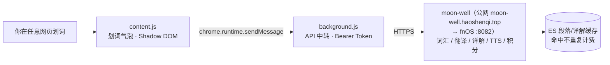

# MagicLens 词镜

把 magicbook 的阅读能力带到整个 Web 的 Chrome 扩展：在**任意网页**上划词翻译、查看单词详解、标记认识/生词、朗读，数据与词汇表和 magicbook / moon-well 完全互通——整个互联网都是你的英文书。

> 命名寓意：透镜（lens）= 对准任意页面，透视出翻译、生词与朗读；与 magicbook 同姓 magic。

## 架构

插件是纯前端，调用 [moon-well](https://github.com/haoshenqi-family/moon-well) 的 API（v0.4 起后端有配套改动：单词详解接口 + magicbook-vocabulary 缓存索引）：

- 为什么请求经 background 中转：MV3 中 content script 的 fetch 遵循页面源 CORS 规则，service worker 持有 `host_permissions` 豁免，且不受 http 页面的混合内容限制。
- 为什么 UI 用 closed Shadow DOM：与页面样式完全互不干扰。

## 当前状态（P0）

| 能力 | 状态 | 实现 |
| --- | --- | --- |
| 划词翻译（单词/段落，≤2000 字符） | ✅ | `POST /vocabulary/reading/translate` |
| 单词详解（v0.4.0） | ✅ | `GET /vocabulary/detail/{word}`：六板块（基本意思/词源/搭配·用法·习语/变体与衍生词/同反义词/俚语冷知识）；划词变体自动还原词目（ran→run）；moon-well 侧 ES 缓存（magicbook-vocabulary 索引），重复查询不重复计费 |
| 标记认识 / 加入生词本 | ✅ | `GET /vocabulary/known/{word}` · `GET /vocabulary/unknown/{word}` |
| 本地朗读 | ✅ | 浏览器 speechSynthesis（不走后端） |
| 设置页 | ✅ | 登录化（v0.3.0）：Authentik OIDC 登录 + 回调自动捕获令牌 + 401 静默刷新；无手动配置项 |
| AI 伴读聊天抽屉 | ✅（v0.2.0） | `POST /ai/agent/chat` SSE 直连 content script；会话/记忆/学情面板；划词「问 AI」联动；moon-well 前置（web prompt + skipMemoryExtract）已上线 |
| 段落整页翻译 + 生词波浪线标注 | 规划 P1 | `translate-batch` + `analyze` |
| moon-well 声音朗读（DashScope） | 规划 P2 | `POST /tts/speak` |

## 安装（开发者模式）

1. 克隆本仓库；
2. Chrome 打开 `chrome://extensions`，右上角开启「开发者模式」；
3. 「加载已解压的扩展程序」，选择本仓库的 `extension/` 目录；
4. 点击扩展图标 → 「设置」→ **「登录」**：打开 moon-well 的统一登录页（Authentik，与 magicbook 同一账号），成功后令牌自动保存并静默续期（access 7 天 / refresh 30 天自动刷新），**无需手动填任何 Token**。后端固定走公网域名 `https://moon-well.haoshenqi.top`（Server 2 Traefik → fnOS，含 X-User-* 信任头剥离），内外网均可用。还没有账号？设置页点 **「注册」** 走邀请制流程（与 magicbook 同一条 invitation-enrollment 链路），注册完回来登录即可。

> MagicLens 与 magicbook 的关系：插件是 magicbook 阅读能力的浏览器版——同一账号、同一后端（moon-well），划词翻译/生词本/长期记忆/伴读 AI 数据完全互通；magicbook 读书架里的电子书，MagicLens 把整个网页当作你的书。

## API 契约

以 moon-well 代码为准（`ReadingVocabularyController` / `VocabularyController` / `ReadingSettingsController`），统一包装 `Result{success, result, message}`：

| 端点 | 方法 | 请求体 | 说明 |
| --- | --- | --- | --- |
| `/vocabulary/reading/translate` | POST | `{text}`（1..2000） | 划词/选区翻译 → `{text, translation, source}` |
| `/vocabulary/reading/translate-batch` | POST | `{paragraphs[≤20], bookName?, chapter?}` | 段落批量翻译 → `List<String>` |
| `/vocabulary/reading/analyze` | POST | 阅读上下文（bookId 等可空） | 生词判定 → 需标注的词列表 |
| `/vocabulary/known/{word}` · `/unknown/{word}` | GET | — | 标记认识 / 入生词本 |
| `/vocabulary/detail/{word}` | GET | — | 单词详解（v0.4.0）：六板块结构化 JSON；变体入参自动还原词目，缓存按词目落档 |
| `/vocabulary/reading/settings` | GET | — | 阅读偏好（也用作连接测试） |
| `/tts/speak` | POST | `{text}`（1..2000，65s 超时） | 音频二进制（P2 接入） |

## 关联文档

- 可行性评估与决策记录：`docs/design.md`（源自 magicbook 仓库 `response.md` R118/R119）
- 上游项目：[magicbook](https://github.com/haoshenqi-family/magicbook)（阅读器，逻辑移植来源）、[moon-well](https://github.com/haoshenqi-family/moon-well)（后端 API）

## 待办（启动前置）

- [x] moon-well：`agent-chat-system-web` prompt 分支 + `skipMemoryExtract` 字段（2026-10-04 已上线，moon-well R97）；
- [x] moon-well 公网 HTTPS 入口：`moon-well.haoshenqi.top`（2026-10-04 上线，Traefik → fnOS:8082，含 X-User-* 信任头剥离）；
- [x] Token 自助获取：v0.3.0 登录化（Authentik 登录 + 回调自动捕获 + 静默刷新）；
- [ ] P1：段落翻译与生词标注。
