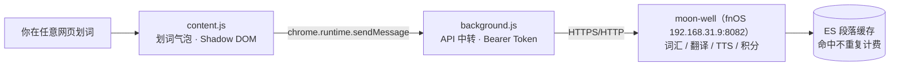

# MagicLens 词镜

把 magicbook 的阅读能力带到整个 Web 的 Chrome 扩展：在**任意网页**上划词翻译、标记认识/生词、朗读，数据与词汇表和 magicbook / moon-well 完全互通——整个互联网都是你的英文书。

> 命名寓意：透镜（lens）= 对准任意页面，透视出翻译、生词与朗读；与 magicbook 同姓 magic。

## 架构

插件是纯前端，直接调用 [moon-well](https://github.com/haoshenqi-family/moon-well) 既有 API，**后端零改动**：

- 为什么请求经 background 中转：MV3 中 content script 的 fetch 遵循页面源 CORS 规则，service worker 持有 `host_permissions` 豁免，且不受 http 页面的混合内容限制。
- 为什么 UI 用 closed Shadow DOM：与页面样式完全互不干扰。

## 当前状态（P0）

| 能力 | 状态 | 实现 |
| --- | --- | --- |
| 划词翻译（单词/段落，≤2000 字符） | ✅ | `POST /vocabulary/reading/translate` |
| 标记认识 / 加入生词本 | ✅ | `GET /vocabulary/known/{word}` · `GET /vocabulary/unknown/{word}` |
| 本地朗读 | ✅ | 浏览器 speechSynthesis（不走后端） |
| 设置页（服务地址 / Token / 自动翻译） | ✅ | `chrome.storage.sync` 本地保存 |
| 段落整页翻译 + 生词波浪线标注 | 规划 P1 | `translate-batch` + `analyze` |
| moon-well 声音朗读（DashScope） | 规划 P2 | `POST /tts/speak` |
| AI 伴读聊天面板 | 规划 P3 | moon-well agent SSE（评估见 R119） |

## 安装（开发者模式）

1. 克隆本仓库；
2. Chrome 打开 `chrome://extensions`，右上角开启「开发者模式」；
3. 「加载已解压的扩展程序」，选择本仓库的 `extension/` 目录；
4. 点击扩展图标 → 「设置」，填入 moon-well 地址与 Token：
   - **服务地址**：目前 moon-well 仅内网可达，填 `http://192.168.31.9:8082`（公网入口建立后替换）；
   - **Token**：moon-well 静态 API-key（`user.token`，`mk-` 前缀）或登录 JWT，以 `Authorization: Bearer` 携带，仅存浏览器本地。

## API 契约

以 moon-well 代码为准（`ReadingVocabularyController` / `VocabularyController` / `ReadingSettingsController`），统一包装 `Result{success, result, message}`：

| 端点 | 方法 | 请求体 | 说明 |
| --- | --- | --- | --- |
| `/vocabulary/reading/translate` | POST | `{text}`（1..2000） | 划词/选区翻译 → `{text, translation, source}` |
| `/vocabulary/reading/translate-batch` | POST | `{paragraphs[≤20], bookName?, chapter?}` | 段落批量翻译 → `List<String>` |
| `/vocabulary/reading/analyze` | POST | 阅读上下文（bookId 等可空） | 生词判定 → 需标注的词列表 |
| `/vocabulary/known/{word}` · `/unknown/{word}` | GET | — | 标记认识 / 入生词本 |
| `/vocabulary/reading/settings` | GET | — | 阅读偏好（也用作连接测试） |
| `/tts/speak` | POST | `{text}`（1..2000，65s 超时） | 音频二进制（P2 接入） |

## 关联文档

- 可行性评估与决策记录：`docs/design.md`（源自 magicbook 仓库 `response.md` R118/R119）
- 上游项目：[magicbook](https://github.com/haoshenqi-family/magicbook)（阅读器，逻辑移植来源）、[moon-well](https://github.com/haoshenqi-family/moon-well)（后端 API）

## 待办（启动前置）

- [ ] moon-well 公网 HTTPS 入口（Server 2 Traefik 加路由，如 `api.haoshenqi.top` → fnOS 8082），外网场景可用；
- [ ] Token 自助获取方案（目前需手动从库里取 `user.token`，或用 Authentik OIDC 换 JWT）；
- [ ] P1：段落翻译与生词标注。
